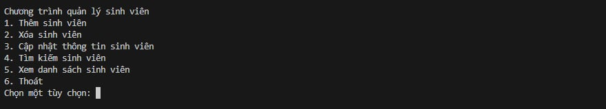
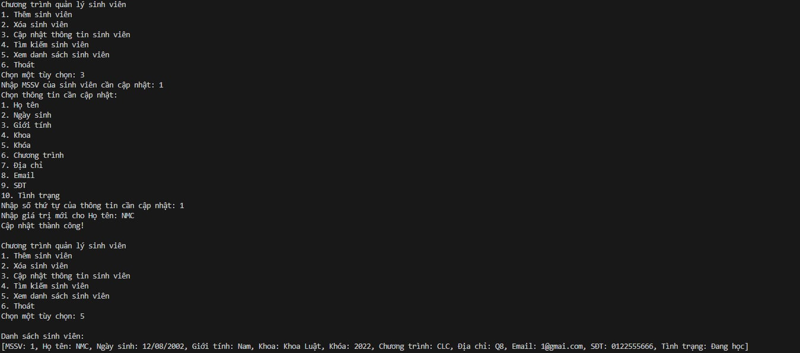
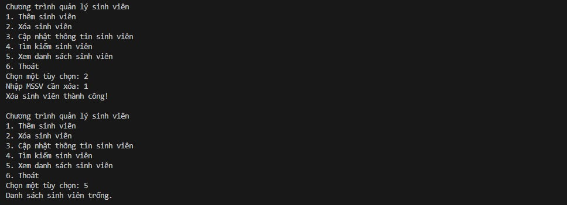
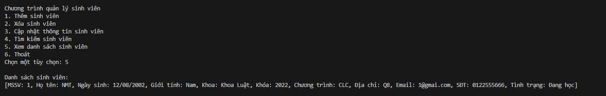

# Student Management System

## Introduction
A command-line Student Management System built with Node.js that provides comprehensive functionality for managing student records. The system enables administrators to perform CRUD operations (Create, Read, Update, Delete) on student data through console interface.

## Features

- **Add Student**: Create new student records with detailed information
  - Name, Student ID
  - Date of Birth
  - Gender
  - Department/Major
  - Contact Information

- **Update Student**: Modify existing student information
  - Update any field
  - Validation of input data
  - Confirmation before changes

- **Remove Student**: Delete student records
  - Remove by Student ID

- **Search Functionality**:
  - Search by Student ID
  - Search by Student Name

- **Display Options**:
  - View all students

## Project Structure
```
Student_ID/
│
├── studentManager.js   # Main application logic
│
└── README.md             # Project documentation
```

## Requirements
- Node.js (version 14.0.0 or higher)

## Installation

1. Ensure Node.js is installed on your system:
   ```bash
   node -v
   ```

2. Navigate to the project directory

3. Start the application:
   ```bash
   node student-management.js
   ```
