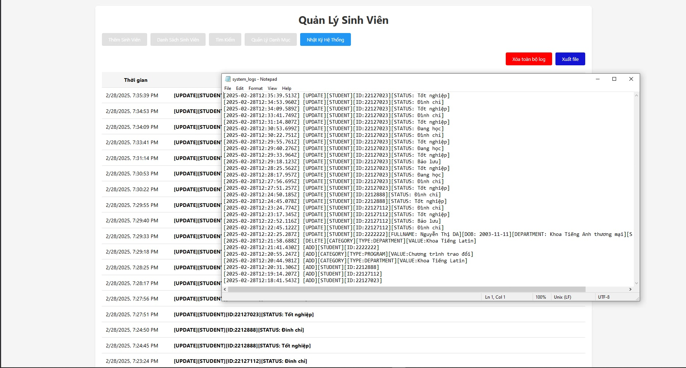

# Student Management System (Version 3)

## Live Demo

Try the application here: [Student Management System](https://student-management-8nnhhly4g-minh-toans-projects.vercel.app/)

## Introduction

This project is an enhanced version of the Student Management System, designed to manage student information efficiently with advanced features and stricter data validation. Building on Version 2, Version 3 introduces unique student IDs, configurable email domains, phone number formatting, controlled status changes, time-based deletion restrictions, and export capabilities for student status certificates. All data continues to be stored in the browser's local storage, with added unit tests and code coverage for improved reliability.

## Features

- **Add Student**: Add new student records with detailed information
  
- **Update Student**: Edit existing student records
  
- **List Student**: Displays a list of students and possible tasks
  
- **Search Students**: Search for students by name, department, and other criteria
- **Filter Students**: Filter students by gender, department, course, program, and status
  
- **Import/Export Data**: Import and export student data in CSV and JSON formats
  
  
- **Category Management**: Manage categories such as departments, programs, and statuses
  
  
- **Logging**: Log all actions for auditing and troubleshooting
  
- **Unique Student ID (MSSV)**: Ensure student IDs are unique when adding or updating records
- **Configurable Email Domains**: Restrict email addresses to specific domains (e.g., @student.university.edu.vn)
- **Valid Phone Number Formatting**: Enforce country-specific phone number formats (e.g., +84 or 0[3|5|7|8|9]xxxxxxxx for Vietnam)
- **Controlled Student Status Changes**: Allow status changes only according to predefined rules (e.g., "Studying" → "On Leave", "Graduated", or "Suspended", but not "Graduated" back to "Studying")
  
- **Time-Based Deletion**: Allow deletion of student records only within a configurable time frame (e.g., 30 minutes) after creation
  
- **Toggle Validation Rules**: Enable or disable validation rules dynamically by config file
- **University Branding**: Display the university logo or name on all screens
  
- **Category Deletion with Constraints**: Allow deletion of departments, statuses, or programs only if no student data is associated
  
- **Export Student Status Certificates**: Generate student status certificates in two formats (HTML, MD)
  
  
- **Unit Tests and Code Coverage**: Implement unit tests and measure code coverage for key modules (logManager.js, studentManager.js)
  

## Project Structure

```
student-management/
├── .gitignore
├── assets
├── categoryFunctions.js
├── categoryManager.js
├── config.js
├── config.json
├── coverage
├── docs/
│   └── unit_test_group_work.pdf
├── index.html
├── log.test.js
├── logFunctions.js
├── logManager.js
├── main.js
├── package.json
├── README.md
├── screenshots
├── setup.test.js
├── studentFunctions.js
├── studentManager.js
├── studentManager.test.js
└── style.css
```

## File Descriptions

- **categoryFunctions.js**: Contains functions for category management.
- **categoryManager.js**: Manages categories such as departments, programs, and statuses. Includes functions to add, remove, and display categories, with checks for data constraints.
- **config.js**: Contains logic for loading and initializing configurations.
- **config.json**: Configuration file for the application.
- **coverage/**: Directory containing coverage reports generated by Jest.
- **docs/**: Directory containing documentation.
  - **unit_test_group_work.pdf**: Documentation on unit testing.
- **index.html**: The main HTML file that provides the user interface for the application, including university branding.
- **log.test.js**: Contains unit tests for the log manager.
- **logFunctions.js**: Contains functions for log management.
- **logManager.js**: Manages the logging of actions. Includes functions to add, clear, and filter logs, with unit tests for reliability.
- **main.js**: Main JavaScript file that initializes the application and handles events.
- **package.json**: Contains project metadata and dependencies.
- **screenshots/**: Contains screenshots demonstrating the application's features.
- **setup.test.js**: Contains setup code for unit tests.
- **studentFunctions.js**: Contains functions for student management.
- **studentManager.js**: Manages student records. Includes functions to add, update, delete, search, and filter students, handle imports/exports, enforce unique IDs, email domains, phone formats, status rules, and time-based deletions.
- **studentManager.test.js**: Contains unit tests for the student manager.
- **style.css**: Contains the CSS styles for the application, including university logo integration.

## Requirements

- Node.js
- Jest (for unit testing and code coverage)

## Installation

### Method 1: Using Git and Node.js

1. Clone the repository:

   ```bash
   git clone https://github.com/JonasAugust12/student-management
   cd student-management
   ```

2. Install dependencies:

   ```bash
   npm install
   ```

3. Install Live Server (if not already installed):

   ```bash
   npm install -g live-server
   ```

4. Run the application:

   ```bash
   npm start
   ```

5. Open the application:
   - The application should automatically open in your default web browser
   - If not, navigate to http://127.0.0.1:8080 (your port) in your browser

### Method 2: Using VS Code Live Server

1. Open the project folder in VS Code
2. Install the Live Server extension (if not already installed)
3. Right-click on index.html and select "Open with Live Server"
4. The application will open in your browser

## Running Tests and Code Coverage

Run unit tests:

```bash
npm test
```

Generate code coverage report:

```bash
npm run coverage
```

The coverage report will be available in the coverage folder.
