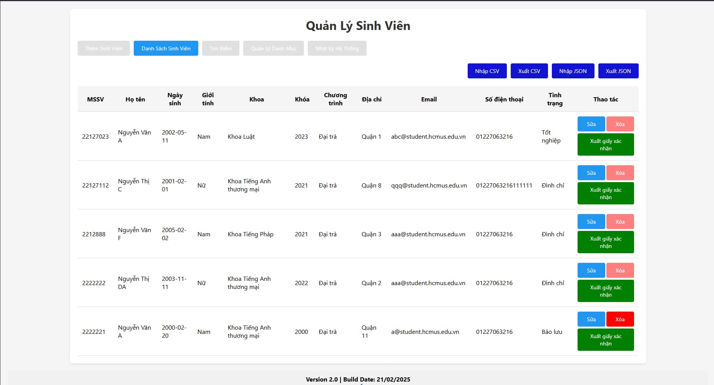

# Student Management System

## Live Demo
Try the application here: [Student Management System](https://student-management-5q1qwrfju-minh-toans-projects.vercel.app/)

## Introduction
This project is a Student Management System designed to manage student information efficiently. It includes features for adding, updating, deleting, searching, and filtering student records. The system also supports importing and exporting data in CSV and JSON formats and logs all actions for auditing purposes. All data is stored in the browser's local storage.

## Features
- **Add Student**: Add new student records with detailed information

- **Update Student**: Edit existing student records

- **Delete Student**: Remove student records

- **Search Students**: Search for students by name, department, and other criteria
- **Filter Students**: Filter students by gender, department, course, program, and status

- **Import/Export Data**: Import and export student data in CSV and JSON formats


- **Category Management**: Manage categories such as departments, programs, and statuses


- **Logging**: Log all actions for auditing and troubleshooting

- **Local Storage**: Store all data in the browser's local storage
## Project Structure
```
.
├── category.js
├── index.html
├── logging.js
├── manager.js
├── README.md
├── screenshots/
│   ├── add-student.jpg
│   ├── category.jpg
│   ├── edit-category.jpg
│   ├── edit-student.jpg
│   ├── export-csv.jpg
│   ├── export-json.jpg
│   ├── list-student.jpg
│   ├── log-manager.jpg
│   └── search-student.jpg
└── style.css
```

## File Descriptions
- **category.js**: Manages categories such as departments, programs, and statuses. Includes functions to add, remove, and display categories.
- **index.html**: The main HTML file that provides the user interface for the application.
- **logging.js**: Manages the logging of actions. Includes functions to add, clear, and filter logs.
- **manager.js**: Manages student records. Includes functions to add, update, delete, search, and filter students. Also handles importing and exporting data.
- **README.md**: This file, which provides an overview of the project.
- **screenshots/**: Contains screenshots demonstrating the application's features.
- **style.css**: Contains the CSS styles for the application.

## Requirements
- Node.js

## Installation

### Method 1: Using Git and Node.js
1. Clone the repository:
   ```bash
   git clone https://github.com/JonasAugust12/student-management
   cd student-management
   ```

2. Install Live Server (if not already installed):
   ```bash
   npm install -g live-server
   ```

3. Run the application:
   ```bash
   live-server
   ```

4. Open the application:
   - The application should automatically open in your default web browser
   - If not, navigate to http://127.0.0.1:8080 (your port) in your browser

### Method 2: Using VS Code Live Server
1. Open the project folder in VS Code
2. Install the Live Server extension (if not already installed)
3. Right-click on index.html and select "Open with Live Server"
4. The application will open in your browser